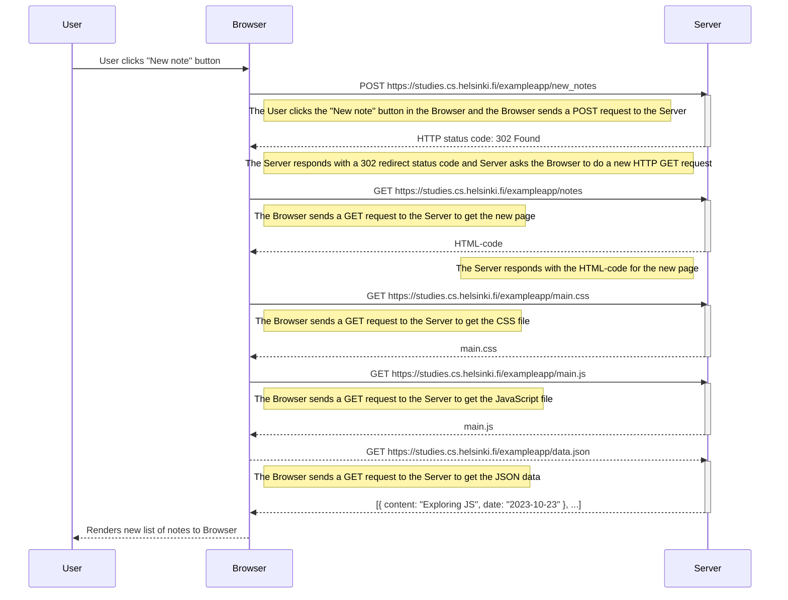

# Exercise 0.4

```mermaid
sequenceDiagram
    participant User
    participant Browser
    participant Server

    User->>Browser: User clicks "New note" button
    Browser->>Server: POST https://studies.cs.helsinki.fi/exampleapp/new_notes
    activate Server
    Note right of Browser: The User clicks the "New note" button in the Browser and the Browser sends a POST request to the Server
    Server-->>Browser: HTTP status code: 302 Found
    deactivate Server
    Note left of Server: The Server responds with a 302 redirect status code and Server asks the Browser to do a new HTTP GET request

    Browser->>Server: GET https://studies.cs.helsinki.fi/exampleapp/notes
    activate Server
    Note right of Browser: The Browser sends a GET request to the Server to get the new page
    Server-->>Browser: HTML-code
    deactivate Server
    Note left of Server: The Server responds with the HTML-code for the new page


    Browser->>Server: GET https://studies.cs.helsinki.fi/exampleapp/main.css
    activate Server
    Note right of Browser: The Browser sends a GET request to the Server to get the CSS file
    Server-->>Browser: main.css
    deactivate Server


    Browser->>Server: GET https://studies.cs.helsinki.fi/exampleapp/main.js
    activate Server
    Note right of Browser: The Browser sends a GET request to the Server to get the JavaScript file
    Server-->>Browser: main.js
    deactivate Server

    Browser-->>Server: GET https://studies.cs.helsinki.fi/exampleapp/data.json
    activate Server
    Note right of Browser: The Browser sends a GET request to the Server to get the JSON data
    Server-->>Browser: [{ content: "Exploring JS", date: "2023-10-23" }, ...]
    deactivate Server

    Browser-->>User: Renders new list of notes to Browser


```
