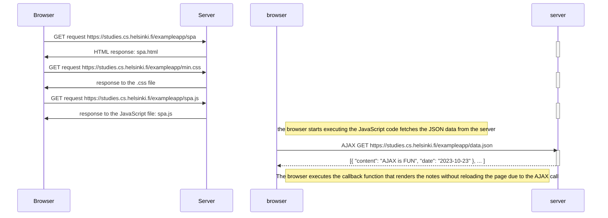

```mermaid
sequenceDiagram
    participant Browser
    participant Server

    Browser->>Server: GET request https://studies.cs.helsinki.fi/exampleapp/spa
    activate server
    Server->>Browser: HTML response: spa.html
    deactivate server

    Browser->>Server: GET request https://studies.cs.helsinki.fi/exampleapp/min.css
    activate server
    Server->>Browser: response to the .css file
    deactivate server

    Browser->>Server: GET request https://studies.cs.helsinki.fi/exampleapp/spa.js
    activate server
    Server->>Browser: response to the JavaScript file: spa.js
    deactivate server

    Note right of browser: the browser starts executing the JavaScript code fetches the JSON data from the server

    browser->>server: AJAX GET https://studies.cs.helsinki.fi/exampleapp/data.json
    activate server
    server-->>browser: [{ "content": "AJAX is FUN", "date": "2023-10-23" }, ... ]
    deactivate server

    Note right of browser: The browser executes the callback function that renders the notes without reloading the page due to the AJAX call

```
